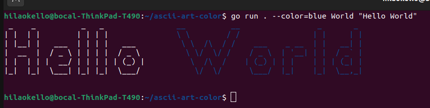
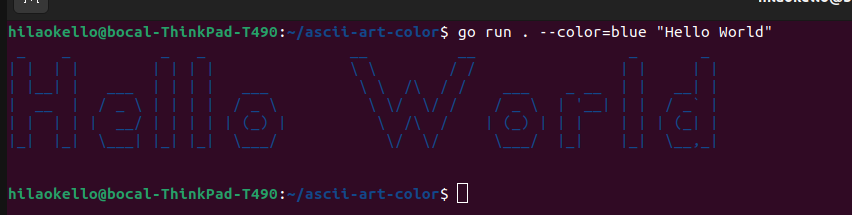
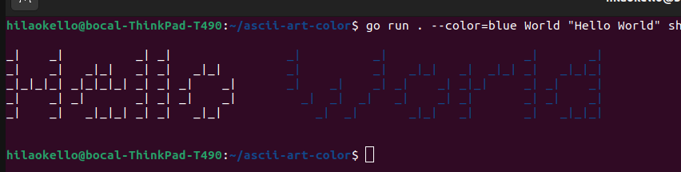
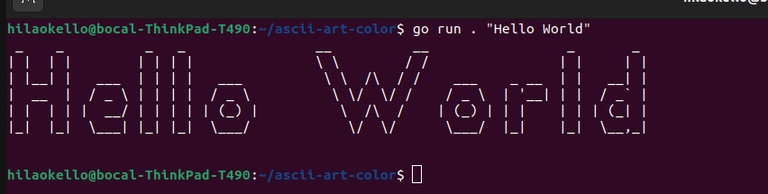

# ascii-art-color

Ascii art color is a command line programs written in Go that prints an ascii art representation of a string to the terminal based on a banner style and with the ability to specify the color(of the string) or a substring to be colored within the string.

### Required
You need to have at least go version go1.22.0 or higher to run the program. You can download and install it from the official Go website.

### Installation
The project has been stored in the following repository and can be cloned and accessed in your local machine using these commands;
```bash
git clone https://learn.zone01kisumu.ke/git/hilaokello/ascii-art-color
cd ascii-art-color
```
### Usage
To run the program, you must define your [OPTION], which is a flag: --color=\<color\> \<substring to be colored>. Where color is your color and the substring to be colored (optional) is a substring within [STRING] you want colored.And a [STRING] which is the string you want an ascii representation of. If a substring is not specified, the whole string would be colored.

```bash
go run . [OPTION] [STRING]
```
#### An example of a properly formated command

```bash
go run . --color=blue World "Hello World"
```

#### Without a substring to be colored

```bash
go run . --color=blue "Hello World"
```

#### You could also specifiy the banner style as either 'standard', 'shadow', or 'thinkertoy'.
```bash
go run . --color=blue World "Hello World" shadow
```

#### The program will also run if only the string is passed.
```bash
go run . "Hello World"
```

### Contribute to the ascii-art-color Project

start by cloning the repository with git clone https://learn.zone01kisumu.ke/git/hilaokello/ascii-art-color and navigating to the project directory with cd ascii-art-color Review the code, make your improvements or add features, and test your changes. Once satisfied, submit a pull request detailing your contributions. 

### Authors
This project was a collaboration of  three apprentices from [z01Kisumu](https://www.zone01kisumu.ke/). 

1. [Hillary Okello](https://github.com/HilaryOkello)
2. [Quinter Ochieng](https://github.com/apondi-art)
3. [John Opiyo](https://github.com/SidneyOps75)

## License

This project is licensed under the [MIT License](./LICENSE.txt)
