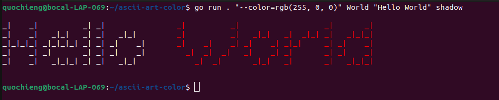

# Ascii-Art-Color

Ascii art color is a command line programs written in **Go** that prints an ascii art representation of a string to the terminal based on a **banner style** and with the ability to specify the **color**(of the string) or a **substring** to be colored within the **string**.

### Required
You need to have the latest go version installed. You can install it from the official [Go website](https://go.dev/doc/install).

### Installation
The project is available in the following repository and can be cloned and accessed in your local machine using these commands;
```bash
git clone https://learn.zone01kisumu.ke/git/hilaokello/ascii-art-color
cd ascii-art-color
```
### Usage
To run the program, you can define your [OPTION], which is a flag: `--color=<color>`  and an optional `<substring to be colored>`. Where color is your color and the substring to be colored (optional) is a substring within a [STRING]. [STRING]is the string you want an ascii representation of. If a substring is not specified, the whole string would be colored. You can also specify an optional banner styles: **shadow, thinkertoy, and shadow**.

```bash
go run . [OPTION] [STRING] [BANNER]
```
#### An example of a properly formated command without banner

```bash
go run . --color=blue World "Hello World"
```

#### Without a substring to be colored

```bash
go run . --color=blue "Hello World"
```

#### With banner defined.
```bash
go run . --color=blue World "Hello World" shadow
```

#### With color value as RGB
```bash
go run . "--color=rgb(255, 0, 0)" World "Hello World" shadow
```

#### With color value as hexadecimal
```bash
go run . --color=#56fbff World "Hello World" thinkertoy
```

#### The program will also run if only the string is passed.
```bash
go run . "Hello World"
```

### Color formats the color flag accepts
- Common colors: `black`, `red`, `green`, `yellow`, `blue`, `magenta`, `cyan`, `white`, `bright black`, `bright red`, `bright red`, `bright green`, `bright yellow`, `bright blue`, `bright magenta`, `bright cyan`, `bright white`, `orange`, `brown`, `purple`, `pink`, `olive`, `teal`, `navy`
- Hexadecimal (examples of correct formats): `#fff`, `#000000`, `#567ABC`, `#ABC`
- RGB (examples of correct formats) : `'rgb(255, 0, 0)'`,`'rgb(0,0,255)'`, `'RGB(134, 23, 205)'`
### Contribute to the ascii-art-color Project

start by cloning the repository with git clone https://learn.zone01kisumu.ke/git/hilaokello/ascii-art-color and navigating to the project directory with cd ascii-art-color Review the code, make your improvements or add features, and test your changes. Once satisfied, submit a pull request detailing your contributions. 

### Authors
This project was a collaboration of  three apprentices from [z01Kisumu](https://www.zone01kisumu.ke/). 

1. [Hillary Okello](https://github.com/HilaryOkello)
2. [Quinter Ochieng](https://github.com/apondi-art)
3. [John Opiyo](https://github.com/SidneyOps75)

### License

This project is licensed under  [MIT License](./LICENSE.txt)
